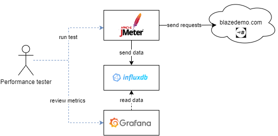
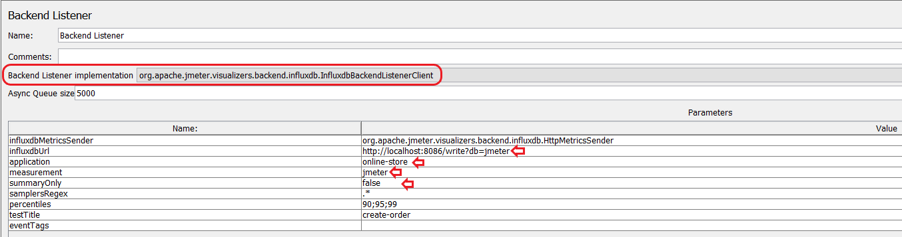

# JMeter / InfluxDB / Grafana
Example setup for visualizing JMeter metrics in Grafana using InfluxDB as storage. The objective is to deploy something like this:



Follow the steps in each of the following sections.

# Requirements

- Install Docker and Docker Compose.
- Install JMeter.

# Deploy

Run the following command with this repository as working directory:
```bash
docker compose up -d
```

# InfluxDB

Log in to the container that has InfluxDB installed:

```bash
docker exec -ti jmeter-influxdb-grafana-influxdb-1 bash
```

Use `influx` client to create a database called `jmeter`:

```bash
$ influx
> CREATE DATABASE jmeter
> SHOW DATABASES
```

# Grafana

In your browser go to: [http://localhost:3000](http://localhost:3000).

## Setup Data Source
To login use the default usename/password: **admin/admin**.

Go to:

1. Configuration.
2. Data soruces.
3. Add data source.
4. InfluxDB:

   - Query Language: InfluxQL.
   - URL: `http://influxdb:8086`
   - All other fields can be left empty.
   - Click: Save & test.

## Setup Dashborad

Download a dashboard from the community. You have to make sure it maches the InfluxDB version,
in our case `1.4`.

A good option [here](https://grafana.com/grafana/dashboards/5496-apache-jmeter-dashboard-by-ubikloadpack/).
Click on **Download JSON**.

Go back to Grafana UI:

1. Click on Dashboards.
2. Click on New.
3. Click on Import.
4. Click on Upload JSON file.
5. Pick the file previously downloaded.
6. Under DB name pick: `InfluxDB`.
7. Measurement name: `jmeter`.
7. Click Import.

# JMeter

The example testplan points to the webpage [https://www.demoblaze.com](https://www.demoblaze.com).

Download the [testplan.jmx](./testplan.jmx) from script this repository.

Modify the **Backend Listener** component like the following. Make sure you use your corresponding values:



